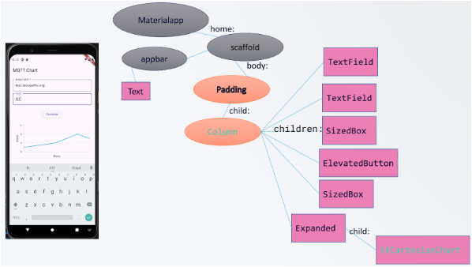
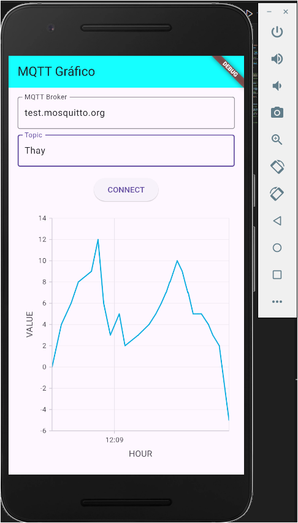
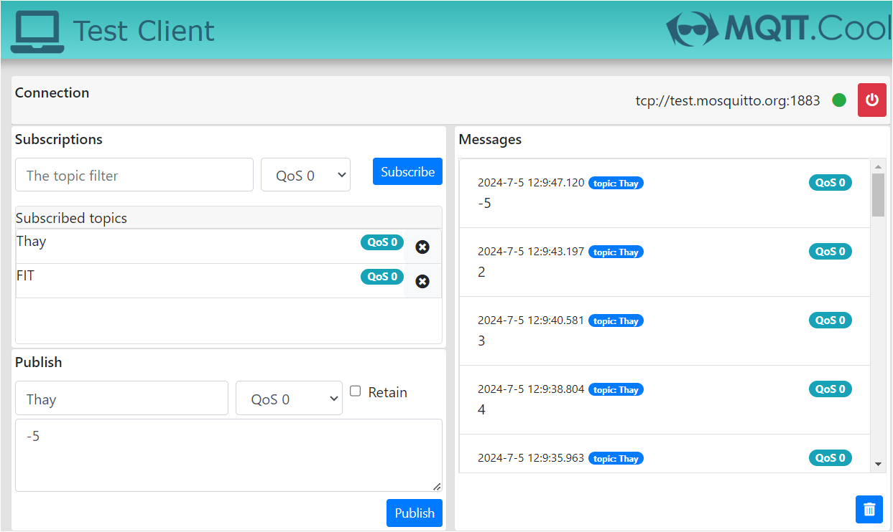

# PROJETO: POPULANDO GRÁFICOS COM DADOS DINÂMICOS DO MQTT

### Fluxo dos widgets:


### Resultado:


### Cliente MQTT utilizado para teste:



# INSTALAÇÕES

````bash
flutter pub add mqtt_client
flutter pub add syncfusion_flutter_charts
flutter pub add intl
````